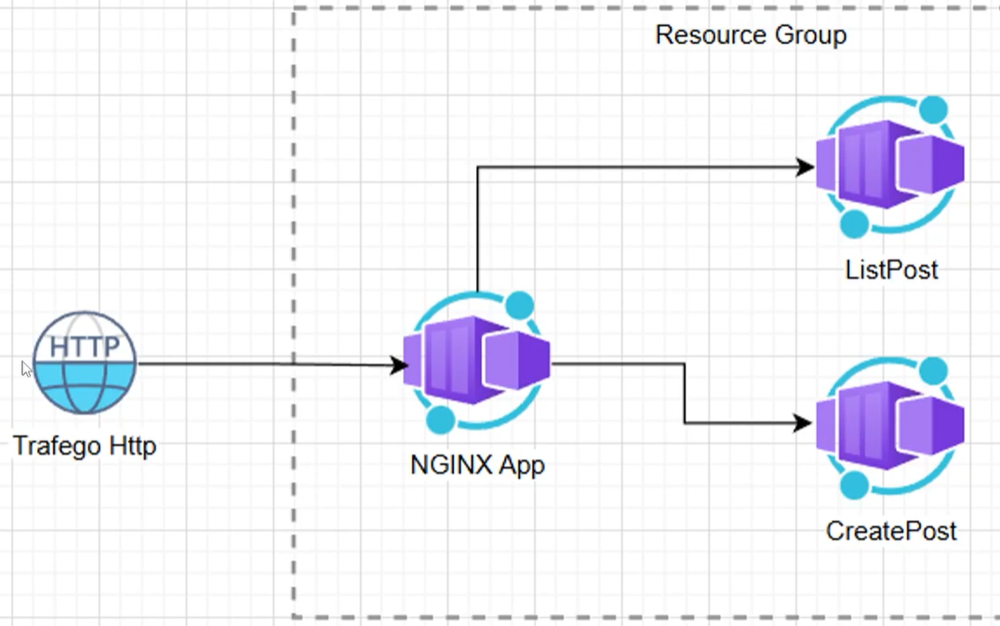

# Blog Project

This project is a simple blog application developed to demonstrate cloud-native application deployment using Microsoft Azure services.

## Architecture


## Features
- Built with containerized architecture using Docker.
- Deployed on **Azure App Service** for seamless scalability and reliability.
- Utilized **Azure Container Registry (ACR)** to store and manage the Docker image.

## Deployment
1. The application was containerized using Docker.
2. The Docker image was pushed to **Azure Container Registry (ACR)**.
3. The application was deployed to **Azure App Service** directly from the container registry.

## Prerequisites
- Azure account with access to Azure App Service and Azure Container Registry.
- Docker installed locally for containerization.

## How to Run Locally
1. Clone the repository.
2. Build the Docker image:
    ```bash
    docker build -t blog-app .
    ```
3. Run the container:
    ```bash
    docker run -p 8080:80 blog-app
    ```
4. Access the application at `http://localhost:8080`.

## License
This project is licensed under the MIT License.

## Note
README.md file created by Microsoft Copilot and adjusted by the project Wglastonio.